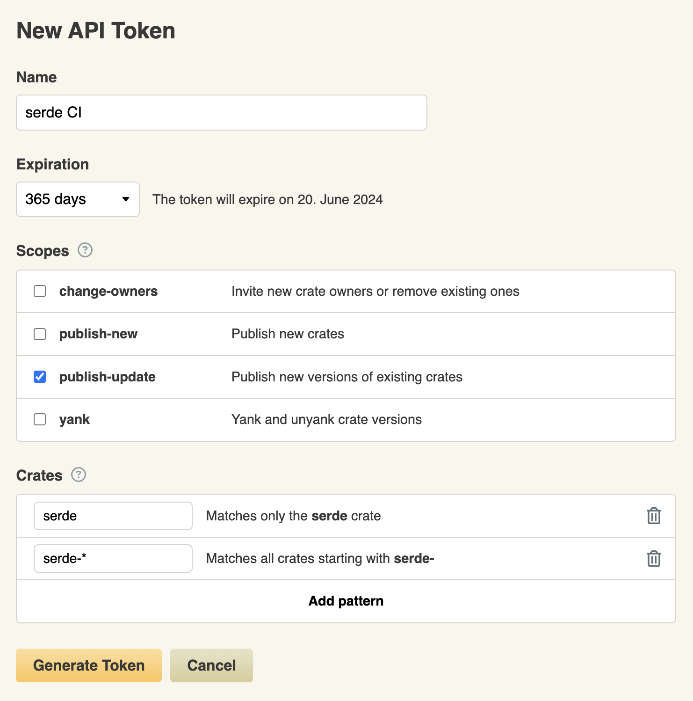

# Maintaining a crate

This page contains the items related to crate maintenance, especially when
you intend to make your crate public.
An obvious risk is a takeover of the crate, for example, on the crates.io repository,
in order to publish malicious versions of your crate.
It is also important to help your consumers (library or binary program users)
tu secure their own supply chain.

## Include necessary information to make the builds consistent

### Include `Cargo.lock` in sources (MAINTAIN-LOCK) { #MAINTAIN-LOCK }

If you develop a binary program, it is important to commit the `Cargo.lock` file in your repository.
This will help keep track of the exact versions used and ensure consistent and (mostly) reproducible builds.

### Include `rust-toolchain.toml` in sources (MAINTAIN-TOOLCHAIN) { #MAINTAIN-TOOLCHAIN }

In the same spirit, providing the Rust version to use in a [`rust-toolchain.toml` file](https://rust-lang.github.io/rustup/overrides.html#the-toolchain-file)
in your binary program sources allows ensuring all builds will use a consistent toolchain version.

```toml
[toolchain]
channel = "1.71.0"
```

## Fine-grained features (MAINTAIN-FEATURES) { #MAINTAIN-FEATURES }

Allow users of the crate to control transitive dependencies depending on their 
needs, using features.
You can still define complete default features including
broad use cases for convenience.

## Maintaining a `-sys` crate building C/C++ code

Some crates which provide bindings for a C or C++ library ([`-sys` crates](https://doc.rust-lang.org/cargo/reference/build-scripts.html#-sys-packages)) are also able to compile
the library statically into the Rust binary. It is convenient but should be

### Provide flags allowing to select the behavior (MAINTAIN-SRCFLAG) { #MAINTAIN-SRCFLAG }

Users need to be able to be sure of the outcome of the build, whether they want to always
embed the library statically, or enforce dynamic linking and make the build fail
if it is missing.
A clear way to express this is to do dynamic linking by default
and provide a flag (`vendored` or similar) to choose to embed the library.

If the default behavior is to embed the library from the crate if missing on the system for convenience,
then it should be documented clearly.

### Use a dedicated crate if possible (MAINTAIN-SRCCRATE) { #MAINTAIN-SRCCRATE }

Instead of building the static library directly in the `-sys` crate, a good practice is
to use a dedicated crate for this purpose (like `openssl-sys` and `openssl-src`).
In this case, you can add the upstream version to the source crate version by using the build version defined in SemVer (defined as MAJOR.MINOR.PATCH+BUILD). For example, for openssl-src it gives `111.16.0+1.1.1l`, `1.1.1l` being the upstream packaged version.

This allows making the presence of the embedded library visible in the cargo tooling
(cargo tree, etc.), and more specifically to get security advisories for the embedded
component through the usual channels (`cargo audit/deny`).
This also allows
correctly documenting the upstream code license separately from the Rust crate.

## Reporting vulnerabilities (MAINTAIN-VULNS) { #MAINTAIN-VULNS }

If you find a vulnerability affecting your crate,
[reporting it to the RustSec advisory database](https://rustsec.org/contributing.html) will get
your users warned if they use
any kind of vulnerability detection on their dependencies.
Reporting to RustSec only is enough, as the advisories will get imported
by GitHub into their advisory own database (allowing alerts and pull requests by _dependabot_ for example),
and assigned a CVE when relevant.

Note: RustSec is only a database for (public) vulnerabilities affecting crates.
For everything related to the Rust toolchain, infrastructure, etc. or
if you need confidentiality, you need to
contact the security response team as per the
[official security policy](https://www.rust-lang.org/policies/security) at [security@rust-lang.org](mailto:security@rust-lang.org).

## Publication on crates.io

When using crates.io for publishing your crates, you need to be careful about a few things.

### GitHub account with 2FA enabled (MAINTAIN-CRATESIO2FA) { #MAINTAIN-CRATESIO2FA }

As crates.io uses GitHub as authentication layer, you should first properly secure your account using general best practices.
In particular,
make sure to have [two-factor authentication layer configured](https://github.com/settings/security)
(and avoid the SMS/Text message method).

### crates.io token configuration (MAINTAIN-CRATESIOTKN) { #MAINTAIN-CRATESIOTKN }

Apart from the Web interface, the other way to interact with crates.io is through its
HTTP API,
especially through cargo commands (`cargo publish`, etc.)
that can run on the developer machine or on CI/CD systems, to automate publication. 
These interactions are authenticated using a token created in the Web interface.

You should crate a unique token for each use-case, and give it a minimal 
set of permissions. Setting an expiration date allows forcing a regular rotation of tokens. For a one-shot operation, set a one-day validity or even revoke the token just after usage.
If you had tokens crated before token scopes were introduced,
you should delete them and recreate more restricted ones.

When using this token in an automated context, it should be stored securely (e.g.
as an [encrypted secret](https://docs.github.com/en/actions/security-guides/encrypted-secrets) in GitHub)
and passed as the
[`CARGO_REGISTRY_TOKEN`](https://doc.rust-lang.org/cargo/reference/config.html?highlight=CARGO_REGISTRY_TOKEN#credentials) environment variable.



## Code security best practices (MAINTAIN-CODESEC) { #MAINTAIN-CODESEC }

Apply security best practices to your code and tests, like [fuzzing](https://rust-fuzz.github.io/book/introduction.html),
testing using [miri](https://github.com/rust-lang/miri), etc.
You can learn more in the [High Assurance Rust](https://highassurance.rs/) book.
