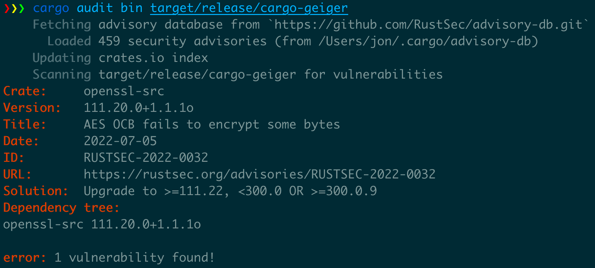

# Running in production

In this section, we will see what we can do to track
potential security issues once the program is deployed.
It won't cover generic deployment security as there are numerous options
(containers, Windows msi/exe installers, Linux rpm/dpkg/etc. packages, etc).

## Audit binaries

### Crates

`cargo audit` has some [capacities
to audit Rust binaries](https://github.com/rustsec/rustsec/tree/main/cargo-audit#cargo-audit-bin-subcommand) for known
vulnerabilities in their dependencies.
It has two operation modes in this context:

* If the binary was build using `cargo-auditable`, it will audit for known vulnerabilities in the embedded dependency list.
* If not, it will audit for known vulnerabilities in a dependency list extracted from panic messages.
  * This is incomplete as not all crates include panics.
  * Depending on the compilation options, panic messages may not be available at all.



You can also use more generic tools like [trivy](https://github.com/aquasecurity/trivy) which is able to look for
known vulnerabilities in Rust binaries by using the same dependency list built by `cargo-auditable`.

```bash
$ trivy image --security-checks vuln docker-image
2022-08-15T11:32:03.923+0300    INFO    Vulnerability scanning is enabled
2022-08-15T11:32:05.031+0300    INFO    Number of language-specific files: 1
2022-08-15T11:32:05.032+0300    INFO    Detecting rust-binary vulnerabilities...

your_binary (rust-binary)
=========================
Total: 1 (UNKNOWN: 0, LOW: 0, MEDIUM: 0, HIGH: 1, CRITICAL: 0)

┌─────────────────┬─────────────────────┬──────────┬───────────────────┬───────────────┬───────────────────────────────────────────────────┐
│     Library     │    Vulnerability    │ Severity │ Installed Version │ Fixed Version │                       Title                       │
├─────────────────┼─────────────────────┼──────────┼───────────────────┼───────────────┼───────────────────────────────────────────────────┤
│    websocket    │    CVE-2022-35922   │ HIGH     │ 0.26.4            │ 0.26.5        │ Untrusted websocket connections can cause an      | 
│                 │                     │          │                   │               │ out-of-memory (OOM) process abort in a client     │
│                 │                     │          │                   │               │ or a server.                                      │
└─────────────────┴─────────────────────┴──────────┴───────────────────┴───────────────┴───────────────────────────────────────────────────┘
```

### Toolchain

You might also want to know which version of the Rust toolchain was used to build a program, for example,
to know if it's affected by a vulnerability in the standard library or the compiler itself.
The compiler version [should be added](https://github.com/rust-lang/rust/pull/97550) in a `.comment` section of the file in the future.
Until then, you can look for the version in the strings included in the binary:

```shell
$ strings ~/.cargo/bin/rg | grep 'rustc version'
clang LLVM (rustc version 1.68.0 (2c8cc3432 2023-03-06))
```

You should keep informed about vulnerabilities affect the Rust toolchain
(compiler, cargo, etc.) as the vulnerability detection
tooling (`cargo audit/deny`) is not able to warn you about these. You can subscribe to the
[security announcement mailing-list](https://www.rust-lang.org/policies/security#security-receiving) linked in the security policy.

## Audit SBOMs

It is also possible to look for known vulnerabilities in a SBOM if they were produced at build time.
